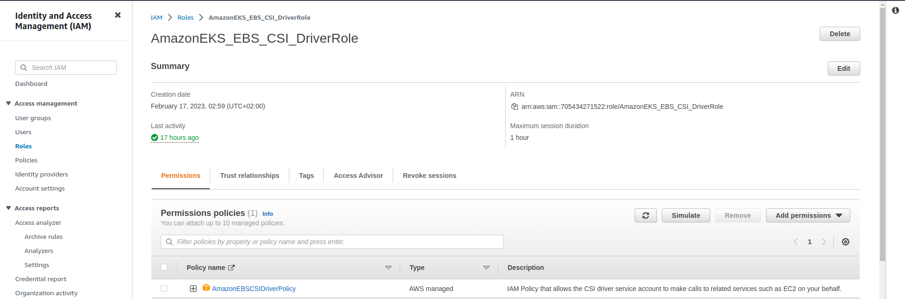
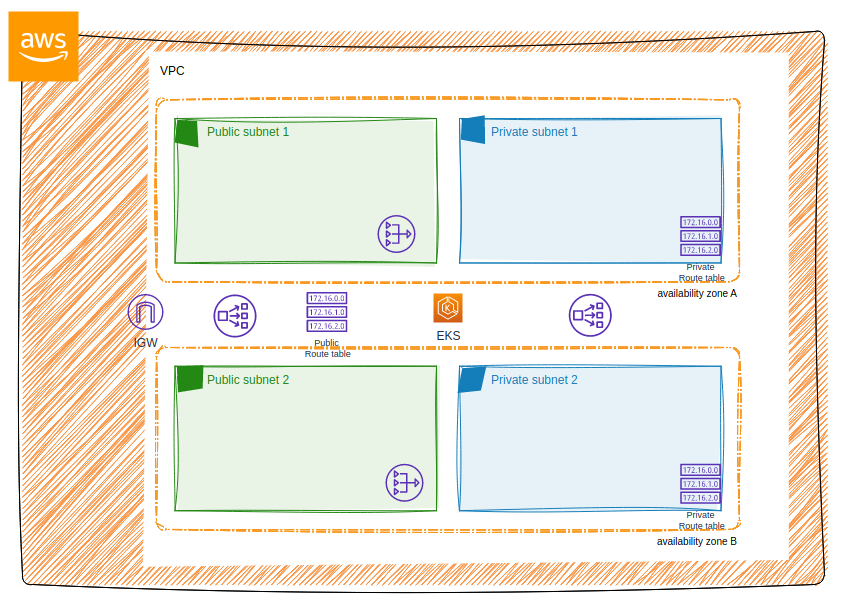
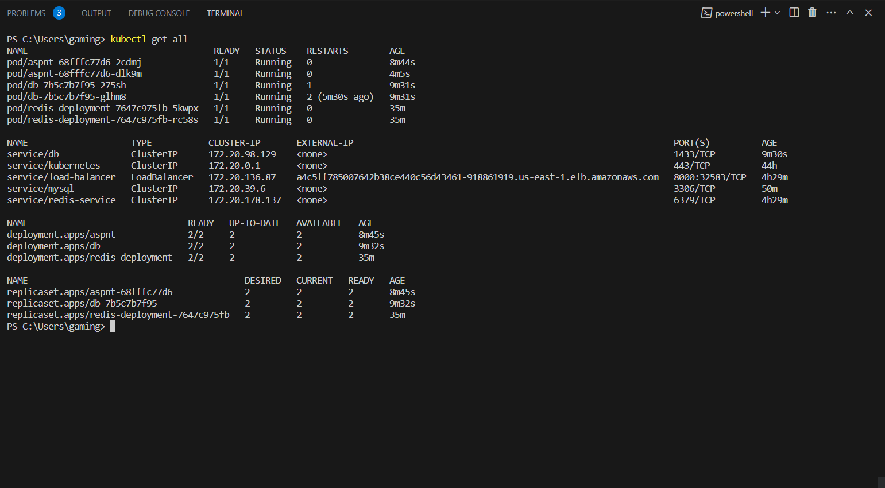

# Deploy application at EkS Cluster 

## Project Overview


## Tools Used in the Project

- EKS: Amazon Elastic Kubernetes Service (EKS) is a managed Kubernetes service used to deploy and manage the web application in a secure and scalable manner.
 - Terraform: Infrastructure as Code (IaC) tool used to define, provision, and manage the underlying infrastructure required for the web application and its deployment.

  - Docker: Containerization platform used to package the web application and its dependencies into a Docker image.

 - AWS: Amazon Web Services (AWS) is a cloud computing platform used to host and manage the infrastructure and resources required for the project. 




## Project Execution

## Part 1: The layer of application 

- 1- The interface : LoadBalancer its carry the domain and the certificate after that will Distributed the traffic [ the first will be public inside it LB]

-  2- Then the loadbalancer gives the traffic to web application 

- 3- The appliction gives the traffic to layer cashing [ Redis: creating it by yaml file  ]

- 4- After Redis there is Database (that can be sql or mongodb  )

- Note: the webapp,redis and database will be in a private subne and loadbalncer will be in a public subnet 

- Should be Auto scalling in everyone of each layer


## Part 2: Infrastructure Overview



- 1- The first step is to to build the infrastructure. 
    - To initialize Terraform:
      ``` terraform init ```
    - To execute a Terraform plan:
      ``` terraform plan ```
    - To apply the Terraform plan and build the infrastructure:
      ``` terraform apply ```

- 2- Install kubectl and the AWS cloud plugin and then 
    - To install kubectl, follow the instructions in the official Kubernetes documentation based on operating system: https://kubernetes.io/docs/tasks/tools/install-kubectl/

    - Install AWS IAM Authenticator:
      ```bash
        sudo apt install -y awscli
     ```

    - Verify Installation:
     ``` aws-iam-authenticator version```

    - AWS CLI Configuration:
    ``` aws sts get-caller-identity```


    - update your kubeconfig and connect to your AWS EKS cluster

    ``` aws eks update-kubeconfig --name your-cluster-name --region your-region```
    ## image 
- Create Dockerfile to the webapp
> - docker build -t <name> .
> - Then push this image to dockerhub 
> - Use the in the yaml file of webapp 

- create file yaml using this image created above

```bash
kubectl create -f asp.yml
kubectl create -f svc.yml
kubectl create -f redis.yml  [ in the redids file contain its service  ]
kubectl create -f sql.yml    [ in the sql file contain its service  ]
kubectl get all 
```




### The application 


